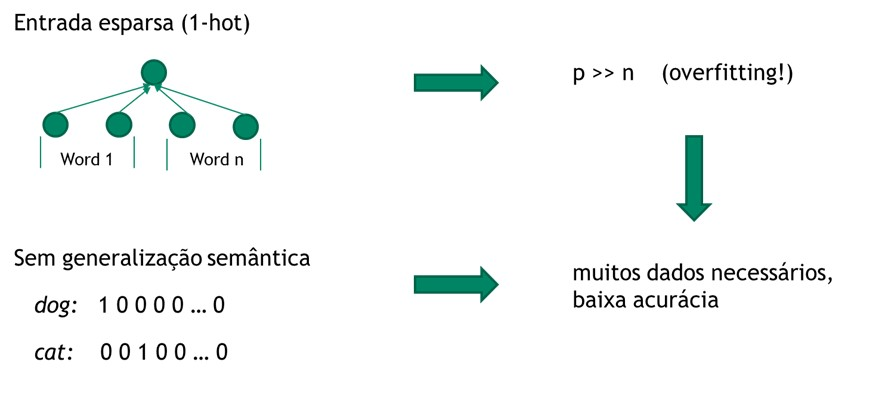
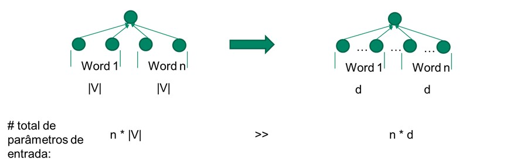
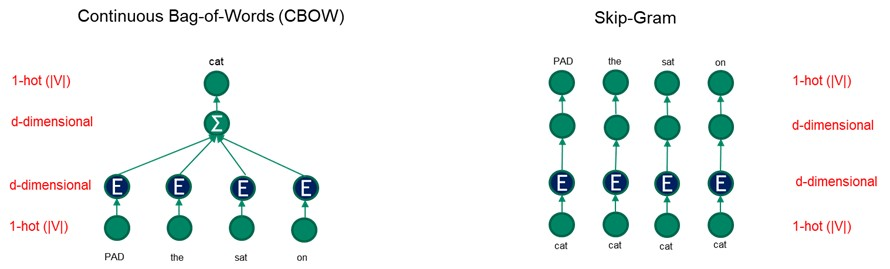
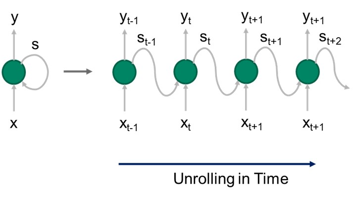
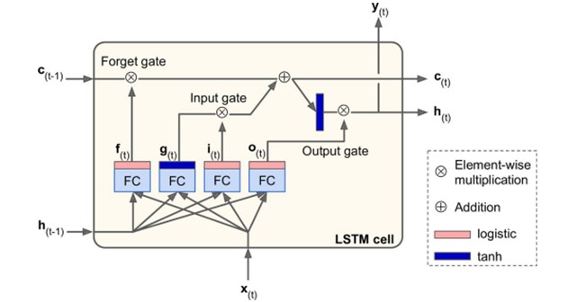
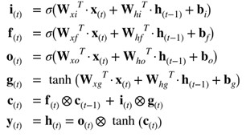
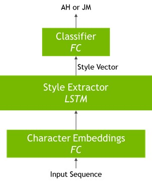

# Fundamentos de Deep Learning para Processamento de Linguagem Natural (Parte 1)

Material do workshop NVIDIA - Fundamentals of Deep Learning for Natural Language Processing - NVIDIA Deep Learning Institute

 O texto original do Workshop foi estruturado e traduzido para português.

 Fonte: NVIDIA Deep Learning Institute

Instrutor: Cristian Enrique Muñoz Villalobos

----

##  Word Embeddings

#### 1. Processamento de Linguagem Natural clássico e Bag-of-Words

##### 1.1.   Modelos Clássicos de PLN

O PLN já estava em uso muito antes do *Deep Learning* aparecer no cenário de IA e ML. Antes de DL, os modelos de PLN implementariam algoritmos como *Hidden Markov Models*, *Conditional Random Forests* e outros tipos como *Probabilistic Graphical Models*. Essas escolhas ainda são muito úteis, especialmente para tarefas simples e/ou quando apenas uma pequena quantidade de dados está disponível.

Uma consideração importante no uso da PLN é como representar a entrada para o algoritmo. No aprendizado de máquina clássico, falamos regularmente sobre "*features*", que são a maneira como codificamos vários conceitos específicos de domínio para a forma numérica que os algoritmos podem manipular. A maneira mais comum de representar palavras é tornando cada palavra um *feature*. Isso é chamado de representação Bag-of-Words (BoW).

| **cat** | **sat** | **on** | **the** | **mat** | **quickly** |
| ------- | ------- | ------ | ------- | ------- | ----------- |
| 1       | 1       | 1      | 2       | 1       | 0           |

 

Neste exemplo, contamos o número de vezes que cada palavra aparece em nosso texto (uma única frase) e tornamos isso o valor do *feature*.

Existem várias maneiras de contar as palavras:

·     Binário - um *feature* terá o valor 1 se a palavra aparecer no texto ou 0 caso contrário.

·     Contagem - Um *feature* terá o número de vezes que a palavra aparece no texto como seu valor, 0 caso contrário.

·     Term Frequency/Inverse Document Frequency (TF-IDF) - O valor do *feature* será uma proporção de quão única é uma palavra em um único documento vs. quão única ela é em todo o corpus de documentos. 

Obviamente, para palavras comuns como o, em, etc. (conhecidas como *stop words*), a pontuação do TF-IDF será baixa. Para palavras mais exclusivas - por exemplo, termos específicos do domínio - a pontuação será maior. Observe que, ao usar BoW, estamos jogando fora informações sobre a ordem das palavras em nosso texto. Isso geralmente funciona, mas pode levar à redução da precisão do modelo.

**1.2.**   **Problemas com representação BoW**

Existem vários problemas com a representação BoW: 

<ins>Entrada esparsa</ins> - como vimos no exemplo anterior, cada palavra é um *feature*. Portanto, ao fornecer esses dados a um modelo, precisamos informá-lo de que nos referimos à característica número 1 na tabela BoW que é gato, e não à característica número 2 que é cachorro. Fazemos isso executando uma codificação 1-hot nos números: criamos um vetor com o tamanho de todo o vocabulário. Em seguida, fornecemos ao índice que desejamos o valor 1, enquanto todos os outros recebem o valor 0. Então, gato será o vetor (1,0,0,…, | V |), cachorro será (0,1,0,0 ,…, | V |), etc. Para um vocabulário grande (ou seja, | V | é grande), isso significa que muitos dos dados de entrada serão esparsos - ou seja, terão o valor 0.  O impacto da dispersão é que o número de *features* (palavras) será potencialmente muito maior do que o número de exemplos que temos, o que quase certamente levará ao *overfitting*.

<ins>Sem generalização semântica</ins> - neste exemplo, cão é o *feature* nº 1, enquanto gato é o nº 2. Observe que isso é completamente arbitrário. Em particular, isso significa que não podemos generalizar. Em outras palavras, o modelo é incapaz de aplicar o conhecimento que aprendeu sobre gatos aos cães, pois ignora completamente que os dois estão relacionados (ambos são animais, têm 4 patas e um rabo, etc.). Idealmente, teríamos gostado de um modelo que lidasse com animais para entender as semelhanças e também as diferenças entre os animais antes de lidar com nossa tarefa específica. Colocando de forma um tanto figurada, gostaríamos que o modelo mostrasse alguma inteligência inata. O resultado desses dois problemas leva ao fato de que um modelo NLP usando representações BoW exigiria muitos dados, mas ainda poderia fornecer baixa precisão.

 

#### 2. Representação Distribuída

##### 2.1. Hipótese Distributiva (HD)

 Um insight importante sobre como representar dados textuais (especificamente, palavras individuais ou lexemas) para um algoritmo vem da Linguística. Em 1957, Firth propôs sua hipótese distributiva. Em palavras simples, o HD significa que palavras semelhantes tendem a aparecer nos mesmos lugares. Fazendo relação à frase: “Você pode dizer a palavra, pela companhia que ela tem”.

	
The cat sat on the mat

	
The dog sat on the mat

	
The elephant sat on the mat

    
The quickly sat on the mat

    

Neste exemplo, dado um conjunto de palavras de contexto (*contexto-words*) que aparecem antes e depois de uma palavra-alvo (*target-word*, coloridas em verde ou vermelho), vemos que as palavras-alvo apropriadas são todos animais. Obviamente, a palavra *quikly* não se encaixa no contexto, principalmente porque é um advérbio, enquanto o contexto estipula um substantivo (ou uma frase que atua como um substantivo, apropriadamente chamada de sintagma nominal-*noun phrase*). No entanto, a palavra *pen* - que é um substantivo - também não seria apropriada neste contexto. Desta vez, a razão é mais semântica do que sintática - e é essa propriedade do HD que gostaríamos de explorar ao dar à nossa representação de entrada uma "inteligência" a priori.

 

##### 2.2.  Propriedades de embeddings

As propriedades que definem um bom *embedding* são:

<ins>São densos </ins> - Os *embeddings* são essencialmente modelos de fator. Como tal, cada componente do vetor *embedding* representa alguma quantidade de um *feature* (latente). Normalmente não sabemos o que esse *feature* representa. No entanto, teremos muito poucos - se houver - zeros que causarão uma entrada esparsa. No exemplo, *x* representa o *embedding* e cada valor da lista representa os *features*.

 x = [0.53, 0.2, -1.2, ….] 

 
<ins>São de baixa dimensão </ins>- um *embedding* tem uma dimensionalidade predefinida (escolhida como um hiperparâmetro). Vimos anteriormente que na representação BoW precisávamos de *|V|* entradas para cada palavra, de modo que o tamanho total da entrada seja *|V|\*n* onde n é o número de palavras que usamos como entrada. Com *embeddings*, nosso tamanho de entrada será *d***n*, onde *d* normalmente está entre 50 e 300. Considerando o fato de que grandes corpora de texto geralmente são muito maiores do que 300 palavras, isso significa que temos uma grande economia no tamanho de entrada - o que pode levar a uma melhor precisão alcançada em um número total menor de instâncias de dados.

<ins>Incorporam a semântica de domínio </ins>- esta propriedade é provavelmente a mais surpreendente, mas também a mais útil. Quando devidamente treinados, os *embeddings* aprendem sobre o significado de seu domínio. No primeiro exemplo, vemos que subtraindo o *embedding* (vetor) do homem (*man*) daquele do rei (*king*) e, em seguida, com o acréscimo do *embedding* da mulher (*woman*), obtemos o valor aproximado do *embedding* da rainha (*queen*). Em essência, o modelo aprendeu a noção semântica de gênero. No segundo exemplo, o modelo aprendeu o conceito de capital. Observe que esta é exatamente a "inteligência" a priori que discutimos anteriormente!

 `king’ - `man` + `woman` ≈ `queen` 
  

 `paris` - `france` + `spain` ≈ `madrid` 

 
<ins>Generaliza facilmente </ins>- Finalmente, em virtude do modelo ter entendido os conceitos semânticos inerentes ao nosso domínio, podemos treinar (os encaixes de) gato, cachorro, elefante, etc. e fazer com que o modelo "entenda" que queremos dizer animais. Quando então apresentamos o modelo com o valor previamente invisível de (incorporação de) ovelha, podemos receber a resposta correta.

 
<ins>Após o treinamento dos embeddings, eles podem ser usados como entrada para tarefas de PLN, como classificação ou recomendação.</ins>

Neste exemplo, comparamos o tamanho da entrada na representação BoW vs. a representação *embeddings*:

No primeiro caso, temos *n* palavras |V|\* (tamanho do vocabulário) neurônios de entrada. Para grandes vocabulários, isso pode facilmente superar - por uma grande margem - o número de neurônios de entrada necessários para *d* (dimensionalidade de incorporação) \*n palavras.

 

##### 3.  Algoritmo Word2Vec

A questão principal agora é como implementar um algoritmo que gere *embeddings* de palavras. Existem vários desses algoritmos, entre eles o mais conhecido Word2Vec que foi inventado por Mikolov et al. enquanto estava no Google. Word2Vec tem duas variantes:

Continuous Bag-of-Words (CBOW): nesta variante, usando várias palavras de contexto, tentamos prever a palavra-alvo (*target-word*). Observe que, ao somar os vetores *embeddings*, perdemos a ordem das palavras, daí o nome BoW.

Skip-Gram: nesta variante, usamos a palavra-alvo (*target-word*) para prever cada uma das palavras do contexto.

Observe as palavras marcadas com PAD - são marcadores de preenchimento, significando que não há palavras reais aqui. Essencialmente, esses são marcadores NULL para denotar palavras de contexto vazias.

Uma propriedade chave do algoritmo Word2Vec é que ele não é supervisionado (ou mais precisamente, auto-supervisionado). Isso significa que ele pode ser treinado com corpora enormes e gerar vetores de *embedding* muito úteis.

 

##### Conclusões do Capítulo

- A representação "clássica" de dados de texto é feita usando BoW e codificação 1-hot, o que pode levar a uma baixa precisão devido à dispersão e falta de generalização semântica

- O uso de representações distribuídas (também conhecidas como *embeddings* de palavras) adiciona algum conhecimento a priori à representação de entrada.

- *Embeddings* de palavras são normalmente usados como entrada para outras tarefas de PLN.

 

--------

## Classificação de Texto

### 1. Redes Neurais Recorrentes e LSTMs

 

Nas redes neurais conhecidas como a Fully-Connected (FC), você pode avançar para frente (da camada i para i + 1) ou propagar informações para trás (da camada i + 1 para i) - por exemplo - ao propagar o erro. Em nenhum momento seguimos na direção horizontal dentro da mesma camada.

Frequentemente, desejamos usar redes neurais para lidar com sequencias de entradas ou saídas: em outras palavras, nossa entrada/saída contem valores diferentes em cada passos de tempo. Neste tipo de problemas, precisamos usar redes neurais recorrentes (*Recurrent Neural Networks -* RNNs). Conforme mostrado no exemplo acima, em cada instante de tempo temos diferentes entradas (os *X*) e diferentes saídas (os *y*). Além disso, temos uma variavel de estado do instante de tempo anterior (os S) que é usada como entrada para o seguinte instante de tempo (com o estado inicial normalmente sendo o vetor 0).

O algoritmo usado para treinar RNNs é apenas o tradicional Backpropagation, aplicada a passos de tempo subsequentes e, portanto, conhecido como Backpropagation-Through-Time (BPTT).

 

### 2. Long Short-Term Memory (LSTM):

As RNNs tradicionais são notoriamente difíceis de treinar. Quando treina-se para longas sequencias, a gradientes do erro muitas vezes tendem a encolher ("desaparecer") ou crescer ("explodir") exponencialmente. Isso significa que as RNNs vanilla têm dificuldade para tratar sequências longas, como as que precisamos para lidar com muitas sequências de texto.

Uma modificação do RNN padrão é a célula Long Short-Term Memory (LSTM), que supera muitos dos problemas mencionados. Básicamente, é um conjunto de vários neurônios, conhecidos como portas, junto com uma célula de memória. Em cada instante de tempo, a célula recebe a entrada (*x*) junto com a célula de memória (*c*) e o estado oculto (*h*) da etapa de instante de tempo anterior. Os portões têm as seguintes funções:

Porta de esquecimento (*f*) - quais partes da célula de memória devem ser "esquecidas"

Porta de entrada (*i*) - quais partes da entrada devem ser aplicadas à célula de memória

Porta de saída (*o*) - quais partes da célula de memória devem ser expostas na saída da célula

O novo estado oculto e o estado da célula de memória são propagados para a próxima etapa. Os parâmetros são aprendidos normalmente usando BPTT.

 

### 3. Exemplo Prático: Atribuição de autoria

Dado um conjunto de documentos e um conjunto de autores, quais autores escreveram quais documentos? Precisamos aprender o "estilo" de cada autor: Palavras e frases comuns, comprimento da frase, uso de pontuação etc.  Isso é conhecido como a ciência da estilometria.

Conjunto de dados: “The Federalist Papers”

·     Conjunto de 85 documentos escritos entre 1787 e 1788 por Alexander Hamilton, James Madison e John Jay sob um pseudônimo e com o objetivo de promover a ratificação da Constituição dos Estados Unidos.

·     A autoria de 12 desses artigos é disputada entre Hamilton e Madison

Suposições:

·     Há apenas um autor por documento, Hamilton ou Madison. Em termos práticos, isso significa que ignoramos os artigos escritos por John Jay e não levamos em consideração um autor "desconhecido" ou uma colaboração entre Hamilton e Madison.

·     O estilo do autor é consistente em todos os documentos e não muda com o tempo, tópico, etc.

Este exemplo tentará designar a Alexander Hamilton ou James Madison como o autor de cada um dos artigos em disputa. Aprenderemos o estilo de cada autor a partir de artigos conhecidos e faremos a rede inferir o autor para os desconhecidos. Detalhes do exemplo pode-se ler no Anexo.

 

### Conclusões do Capítulo

·     RNNs podem ser usados para treinamento em sequências - LSTMs fornecem uma variante fácil de treinar.

·     Usamos LSTMs para aprender e codificar o estilo de sequências de caracteres dos documentos federalistas (“The Federalist Papers”)

·     Determinamos o autor de um documento determinando qual autor escreveu mais sequências em um documento disputado de Artigos Federalistas

 

 

 

### Anexo: Passos para solução do problema

A arquitetura da rede é a seguinte:

Dividimos cada documento em várias sequências de caracteres e os rotulamos com o autor do documento. A razão para isso é que temos um pequeno corpus de documentos relativamente curtos, portanto, treinar um modelo de linguagem em palavras provavelmente será excessivo. Portanto, usamos sequências de caracteres como entradas, portanto, temos centenas de milhares dessas sequências. Observe que nosso pré-processamento de dados de entrada coloca o texto em letras minúsculas, mas retém a pontuação, pois são importantes para determinar o estilo do autor.

Aprendemos *embeddings* para cada personagem. Isso pode parecer contraintuitivo: na verdade, aumentamos a dimensionalidade de nossa entrada! No entanto, como vimos no laboratório anterior, os embeddings aprendem recursos úteis do domínio. Nesse caso, esses recursos se aplicam diretamente ao estilo do autor que procuramos.

Prosseguimos alimentando a sequência de caracteres (incorporada) a uma célula LSTM. É aqui que fazemos o aprendizado real dos recursos de estilo. Pegamos a saída do timestep final do LSTM Style Extractor como nossa saída (descartando todos os timesteps anteriores) e o tratamos como uma codificação do estilo da sequência. Também veremos uma representação 2-D desses vetores - se nossa rede fizer um bom trabalho, veremos um agrupamento distinto de vetores AH vs. JM.

Por fim, alimentamos o vetor de estilo em um classificador multicamadas *Full-Connected* que gera AH ou JM como saída. Comparamos essa saída com as referências (ground-truth) durante o treinamento para determinar o erro. Durante a inferência, contamos o número de sequências AH / JM e o "vencedor" é considerado o autor do documento em disputa.
